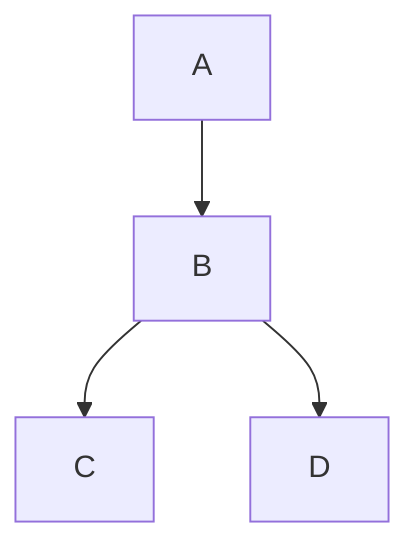

# MkDocs examples

## Insert link

- [link to relative page](./index.md)
- [link to anchor](#embbed-external-website)
- [link to absolute page](/doc-examples#insert-videos)

## Insert graph

## Insert image

## Insert videos

## Embbed external website

<iframe src="https://excalidraw.com" width=600 height=400></iframe>
