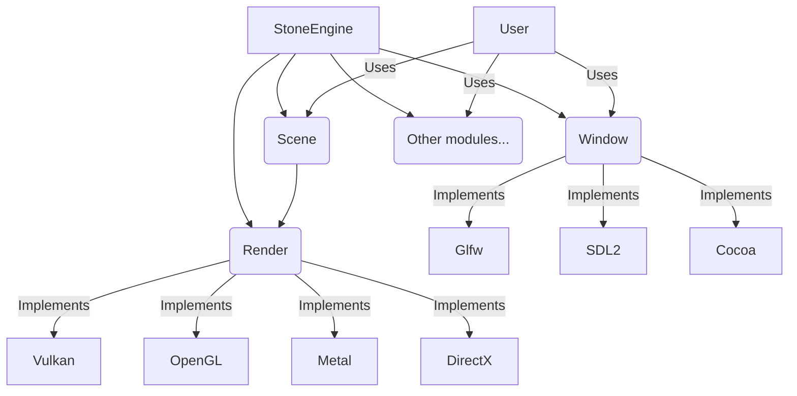

# 🗿 Introduction

StoneEngine is a 3D game engine used to make some things move on your screen with some behavior you define using some wizardly black magic known as "`coding in C++`".

It is not using 3D renderers as dependencies but implements its own using low level graphic library like Vulkan, Metal or DirectX which grant the most basic access to the GPU features.

As the user of StoneEngine, you don't have to do anything related to the library that is used.
Indeed, the engine abstract everything related to the library and you only have to focus on actual gameplay. It is at build time that you can choose to compile the engine with a specific graphic and window library from the ones that are implemented.

You can choose to use Vulkan, OpenGL, Metal or DirectX. The first one is actually implemented and I lied about the others. But the point is that this behavior is fully abstracted.

The same goes for the Windowing libraries. Glfw is implemented but you don't have to know anything about it.

